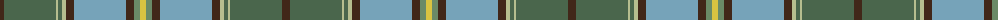

The parent of this is [Carter (Savannah)](/tartans/t/8/n52/na2/n4/na4/t8/b52/t8/g6/y/6/)

This was sourced from register-of-tartans.  It is a [10 stripes tartan](/stripes/stripes10/).

Original link https://www.tartanregister.gov.uk/tartanDetails.aspx?ref=10259

## Thread count
T/8 N52 Na2 N4 Na4 T8 B52 T8 G6 Y/6

## Palette
Each colour and its ΔE from the base-6 reference it is a variant of.

| Colour | Shade | Base | ΔE (OKLab) |
|---|---|---|---|
| B |  `#76A3B9` | Y  | 0.25 |
| G |  `#6A8A67` | G  | 0.18 |
| N |  `#4A664C` | G  | 0.11 |
| Na |  `#B6BE8F` | Y  | 0.12 |
| T |  `#412719` | B  | 0.18 |
| Y |  `#D9C341` | Y  | 0.03 |

ID: /variants/t/8/n52/na2/n4/na4/t8/b52/t8/g6/y/6-b76a3b9-g6a8a67-n4a664c-nab6be8f-t412719-yd9c341/
