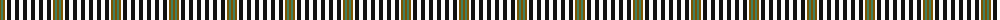

The parent of this is [Burns Check](/tartans/ta/2/ga2/ta2/wa2/k4/wa4/k4/wa4/k4/wa/4/)

This was sourced from register-of-tartans.  It is a [10 stripes tartan](/stripes/stripes10/).

Original link https://www.tartanregister.gov.uk/tartanDetails.aspx?ref=449

## Thread count
Ta/2 Ga2 Ta2 Wa2 K4 Wa4 K4 Wa4 K4 Wa/4

## Palette
Each colour and its ΔE from the base-6 reference it is a variant of.

| Colour | Shade | Base | ΔE (OKLab) |
|---|---|---|---|
| DO |  `#C04C08` | R  | 0.08 |
| DOa |  `#B84C00` | R  | 0.08 |
| DR |  `#880000` | R  | 0.14 |
| G |  `#006818` | G  | 0.02 |
| Ga |  `#408060` | G  | 0.13 |
| K |  `#101010` | K  | 0.17 |
| R |  `#C80000` | R  | 0.00 |
| T |  `#4C3428` | B  | 0.16 |
| Ta |  `#7C5400` | G  | 0.15 |
| Tb |  `#98481C` | R  | 0.11 |
| W |  `#FCFCFC` | W  | 0.03 |
| Wa |  `#FCFCFC` | W  | 0.03 |

ID: /variants/ta/2/ga2/ta2/wa2/k4/wa4/k4/wa4/k4/wa/4-doc04c08-doab84c00-dr880000-g006818-ga408060-k101010-rc80000-t4c3428-ta7c5400-tb98481c-wfcfcfc-wafcfcfc/
