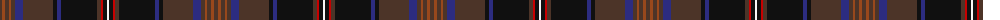

The parent of this is [Capercaillie](/tartans/ta/4/t3/ta4/t2/ta4/db8/ta30/k4/db4/k36/ta4/r2/k4/w/2/)

This was sourced from register-of-tartans.  It is a [14 stripes tartan](/stripes/stripes14/).

Original link https://www.tartanregister.gov.uk/tartanDetails.aspx?ref=558

## Thread count
Ta/4 T3 Ta4 T2 Ta4 DB8 Ta30 K4 DB4 K36 Ta4 R2 K4 W/2

## Palette
Each colour and its ΔE from the base-6 reference it is a variant of.

| Colour | Shade | Base | ΔE (OKLab) |
|---|---|---|---|
| DB |  `#2C2C80` | B  | 0.05 |
| DR |  `#A00000` | R  | 0.09 |
| K |  `#101010` | K  | 0.17 |
| N |  `#5C5C5C` | B  | 0.14 |
| R |  `#C80000` | R  | 0.00 |
| T |  `#98481C` | R  | 0.11 |
| Ta |  `#4C3428` | B  | 0.16 |
| W |  `#F8F8F8` | W  | 0.01 |

ID: /variants/ta/4/t3/ta4/t2/ta4/db8/ta30/k4/db4/k36/ta4/r2/k4/w/2-db2c2c80-dra00000-k101010-n5c5c5c-rc80000-t98481c-ta4c3428-wf8f8f8/
