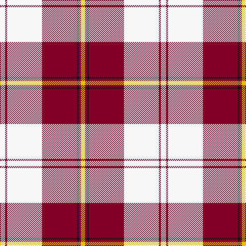

The parent of this is [Cunningham Dress, Burgundy (Dance)](/tartans/w/10/dr4/w68/dr68/k4/dr4/y/8/)

This was sourced from tartans-authority.  It is a [7 stripes tartan](/stripes/stripes7/).

Original link http://www.tartansauthority.com/tartan-ferret/display/1873/

## Thread count
W/10 DR4 W68 DR68 K4 DR4 Y/8

## Palette
Each colour and its ΔE from the base-6 reference it is a variant of.

| Colour | Shade | Base | ΔE (OKLab) |
|---|---|---|---|
| DR |  `#800028` | R  | 0.16 |
| K |  `#101010` | K  | 0.17 |
| W |  `#F8F8F8` | W  | 0.01 |
| Y |  `#E8C000` | Y  | 0.00 |

# Sample pattern

ID: /variants/w/10/dr4/w68/dr68/k4/dr4/y/8-dr800028-k101010-wf8f8f8-ye8c000/
