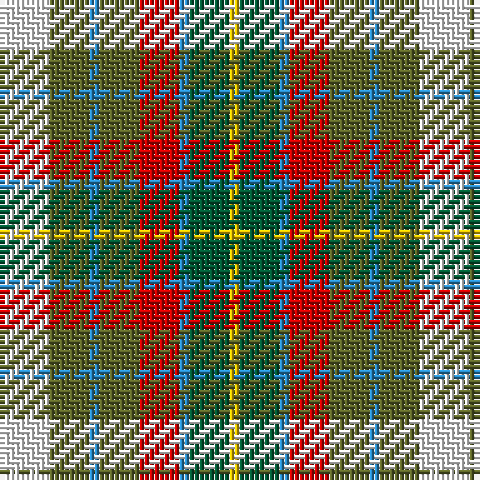

The parent of this is [Devon Rural Skills Trust (Corporate)](/tartans/w/10/g8/b2/g8/r8/b2/ga8/y/2/)

This was sourced from tartans-authority.  It is a [8 stripes tartan](/stripes/stripes8/).

Original link http://www.tartansauthority.com/tartan-ferret/display/2182/

## Thread count
W/10 G8 B2 G8 R8 B2 Ga8 Y/2

## Palette
Each colour and its ΔE from the base-6 reference it is a variant of.

| Colour | Shade | Base | ΔE (OKLab) |
|---|---|---|---|
| B |  `#2888C4` | B  | 0.21 |
| G |  `#5C6428` | G  | 0.09 |
| Ga |  `#005834` | G  | 0.07 |
| R |  `#C80000` | R  | 0.00 |
| W |  `#FCFCFC` | W  | 0.03 |
| Y |  `#E8C000` | Y  | 0.00 |

# Sample pattern

ID: /variants/w/10/g8/b2/g8/r8/b2/ga8/y/2-b2888c4-g5c6428-ga005834-rc80000-wfcfcfc-ye8c000/
