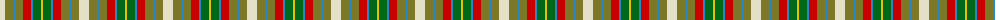
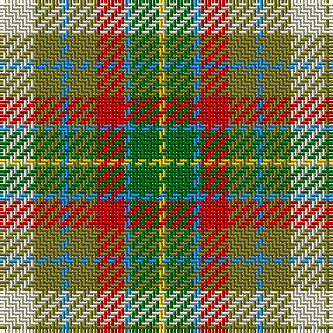

The parent of this is [Devon Rural Skills Trust Corporate Tartan Tartan Number: 2182. Earliest known date: pre 2002 No details. Thread count called for MG8 not a recognised colour code- have used Blue. See products available Copyright © Blair Urquhart, Comrie, 2015](/tartans/w/10/lt8/b2/lt8/ra8/b2/g8/y/2/)

This was sourced from house-of-tartan.  It is a [8 stripes tartan](/stripes/stripes8/).

Original link http://www.house-of-tartan.scotland.net/house/TartanViewjs.asp?colr=Def&tnam=2182

## Thread count
W/10 LT8 B2 LT8 Ra8 B2 G8 Y/2

## Palette
Each colour and its ΔE from the base-6 reference it is a variant of.

| Colour | Shade | Base | ΔE (OKLab) |
|---|---|---|---|
| B |  `#2888C4` | B  | 0.21 |
| DB |  `#2C2C80` | B  | 0.05 |
| G |  `#006818` | G  | 0.02 |
| LT |  `#7C7828` | G  | 0.15 |
| R |  `#C80000` | R  | 0.00 |
| Ra |  `#C80000` | R  | 0.00 |
| W |  `#E4E0C8` | W  | 0.07 |
| Y |  `#E8C000` | Y  | 0.00 |

# Sample pattern

ID: /variants/w/10/lt8/b2/lt8/ra8/b2/g8/y/2-b2888c4-db2c2c80-g006818-lt7c7828-rc80000-rac80000-we4e0c8-ye8c000/
