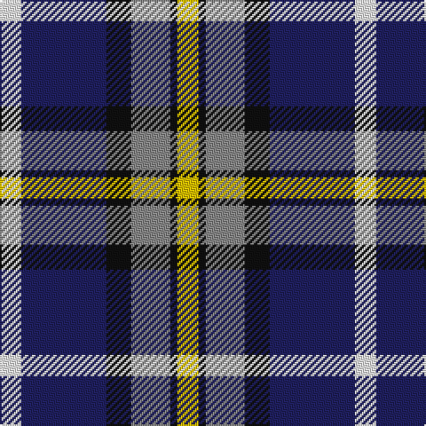

The parent of this is [Clunie Name Tartan Tartan Number: 6708. Earliest known date: 2005 Designed by David McGill of International Tartans for a John and Ben Clunie from Aberdeen and Edinburgh respectively but it can be worn by all of the name. The colours are from the Clunie coat of arms. See products available Copyright © Blair Urquhart, Comrie, 2015](/tartans/w/12/db48/k14/n22/k4/y/12/)

This was sourced from house-of-tartan.  It is a [6 stripes tartan](/stripes/stripes6/).

Original link http://www.house-of-tartan.scotland.net/house/TartanViewjs.asp?colr=Def&tnam=6708

## Thread count
W/12 DB48 K14 N22 K4 Y/12

## Palette
Each colour and its ΔE from the base-6 reference it is a variant of.

| Colour | Shade | Base | ΔE (OKLab) |
|---|---|---|---|
| DB |  `#202060` | B  | 0.11 |
| K |  `#101010` | K  | 0.17 |
| LN |  `#E8E8E4` | W  | 0.04 |
| N |  `#888888` | R  | 0.24 |
| W |  `#F8F8F8` | W  | 0.01 |
| Y |  `#E8C000` | Y  | 0.00 |

# Sample pattern

ID: /variants/w/12/db48/k14/n22/k4/y/12-db202060-k101010-lne8e8e4-n888888-wf8f8f8-ye8c000/
