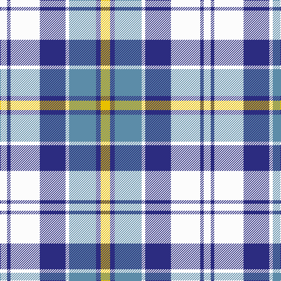

The parent of this is [Culloden Dress, Blue (Dance)](/tartans/w/12/db6/w50/db44/w6/b46/db8/y/16/)

This was sourced from tartans-authority.  It is a [8 stripes tartan](/stripes/stripes8/).

Original link http://www.tartansauthority.com/tartan-ferret/display/1792/

## Thread count
W/12 DB6 W50 DB44 W6 B46 DB8 Y/16

## Palette
Each colour and its ΔE from the base-6 reference it is a variant of.

| Colour | Shade | Base | ΔE (OKLab) |
|---|---|---|---|
| B |  `#5C8CA8` | B  | 0.23 |
| DB |  `#2C2C80` | B  | 0.05 |
| W |  `#FCFCFC` | W  | 0.03 |
| Y |  `#E8C000` | Y  | 0.00 |

# Sample pattern

ID: /variants/w/12/db6/w50/db44/w6/b46/db8/y/16-b5c8ca8-db2c2c80-wfcfcfc-ye8c000/
