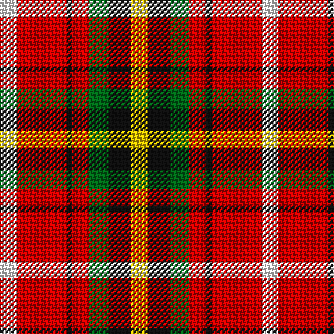

The parent of this is [Thirkill (Dalgliesh)](/tartans/w/12/r36/k4/r12/g14/k16/y/12/)

This was sourced from register-of-tartans.  It is a [7 stripes tartan](/stripes/stripes7/).

Original link https://www.tartanregister.gov.uk/tartanDetails.aspx?ref=4102

## Thread count
W/12 R36 K4 R12 G14 K16 Y/12

## Palette
Each colour and its ΔE from the base-6 reference it is a variant of.

| Colour | Shade | Base | ΔE (OKLab) |
|---|---|---|---|
| G |  `#006818` | G  | 0.02 |
| K |  `#101010` | K  | 0.17 |
| R |  `#C80000` | R  | 0.00 |
| W |  `#FCFCFC` | W  | 0.03 |
| Y |  `#E8C000` | Y  | 0.00 |

# Sample pattern

ID: /variants/w/12/r36/k4/r12/g14/k16/y/12-g006818-k101010-rc80000-wfcfcfc-ye8c000/
