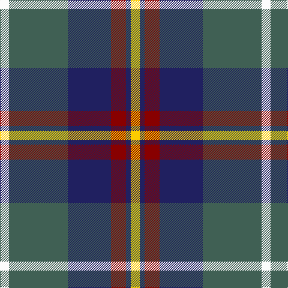

The parent of this is [Afternoon Tea / Darjeeling](/tartans/w/15/n98/db72/dr25/db8/y/15/)

This was sourced from tartans-authority.  It is a [6 stripes tartan](/stripes/stripes6/).

Original link http://www.tartansauthority.com/tartan-ferret/display/11278/

## Thread count
W/15 N98 DB72 DR25 DB8 Y/15

## Palette
Each colour and its ΔE from the base-6 reference it is a variant of.

| Colour | Shade | Base | ΔE (OKLab) |
|---|---|---|---|
| DB |  `#202060` | B  | 0.11 |
| DR |  `#880000` | R  | 0.14 |
| N |  `#406054` | G  | 0.11 |
| W |  `#FCFCFC` | W  | 0.03 |
| Y |  `#FCCC00` | Y  | 0.04 |

# Sample pattern

ID: /variants/w/15/n98/db72/dr25/db8/y/15-db202060-dr880000-n406054-wfcfcfc-yfccc00/
