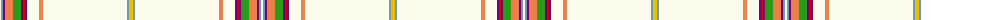

The parent of this is [Kerr of Ardgowan Arisaid (Personal)](/tartans/w/2/b2/p2/o8/g8/p2/r2/p2/w12/o4/w84/b2/y/4/)

This was sourced from tartans-authority.  It is a [13 stripes tartan](/stripes/stripes13/).

Original link http://www.tartansauthority.com/tartan-ferret/display/7321/

## Thread count
W/2 B2 P2 O8 G8 P2 R2 P2 W12 O4 W84 B2 Y/4

## Palette
Each colour and its ΔE from the base-6 reference it is a variant of.

| Colour | Shade | Base | ΔE (OKLab) |
|---|---|---|---|
| B |  `#7498B4` | Y  | 0.27 |
| G |  `#289C18` | G  | 0.18 |
| O |  `#EC8048` | Y  | 0.17 |
| P |  `#780078` | B  | 0.16 |
| R |  `#C80000` | R  | 0.00 |
| W |  `#FCFCEC` | W  | 0.03 |
| Y |  `#E8C000` | Y  | 0.00 |

ID: /variants/w/2/b2/p2/o8/g8/p2/r2/p2/w12/o4/w84/b2/y/4-b7498b4-g289c18-oec8048-p780078-rc80000-wfcfcec-ye8c000/
