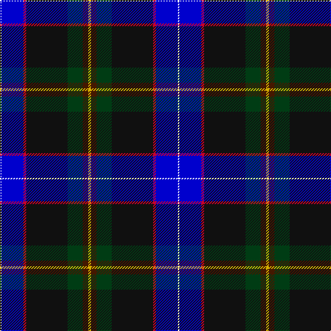

The parent of this is [Buschke (Skye) (Personal)](/tartans/w/2/b32/r4/k60/dg22/dr8/y/4/)

This was sourced from register-of-tartans.  It is a [7 stripes tartan](/stripes/stripes7/).

Original link https://www.tartanregister.gov.uk/tartanDetails.aspx?ref=10899

## Thread count
W/2 B32 R4 K60 DG22 DR8 Y/4

## Palette
Each colour and its ΔE from the base-6 reference it is a variant of.

| Colour | Shade | Base | ΔE (OKLab) |
|---|---|---|---|
| B |  `#0000CD` | B  | 0.15 |
| DG |  `#003C14` | G  | 0.14 |
| DR |  `#441800` | B  | 0.22 |
| K |  `#101010` | K  | 0.17 |
| R |  `#C8002C` | R  | 0.03 |
| W |  `#FFFFFF` | W  | 0.03 |
| Y |  `#D8B000` | Y  | 0.05 |

# Sample pattern

ID: /variants/w/2/b32/r4/k60/dg22/dr8/y/4-b0000cd-dg003c14-dr441800-k101010-rc8002c-wffffff-yd8b000/
