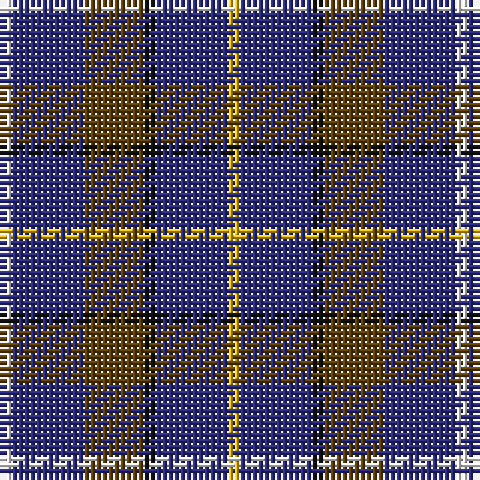

The parent of this is [Atlantic, Ancient (Fashion)](/tartans/w/2/db12/t10/k2/db12/y/2/)

This was sourced from tartans-authority.  It is a [6 stripes tartan](/stripes/stripes6/).

Original link http://www.tartansauthority.com/tartan-ferret/display/3530/

## Thread count
W/2 DB12 T10 K2 DB12 Y/2

## Palette
Each colour and its ΔE from the base-6 reference it is a variant of.

| Colour | Shade | Base | ΔE (OKLab) |
|---|---|---|---|
| DB |  `#2C2C80` | B  | 0.05 |
| K |  `#101010` | K  | 0.17 |
| T |  `#604000` | G  | 0.14 |
| W |  `#FCFCFC` | W  | 0.03 |
| Y |  `#E8C000` | Y  | 0.00 |

# Sample pattern

ID: /variants/w/2/db12/t10/k2/db12/y/2-db2c2c80-k101010-t604000-wfcfcfc-ye8c000/
