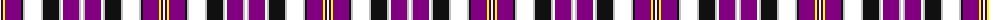

The parent of this is [Praetorian Imperator](/tartans/w/2/dp2/y2/p16/k2/n2/w16/n2/k16/n2/w2/p16/n2/w/2/)

This was sourced from register-of-tartans.  It is a [14 stripes tartan](/stripes/stripes14/).

Original link https://www.tartanregister.gov.uk/tartanDetails.aspx?ref=5819

## Thread count
W/2 DP2 Y2 P16 K2 N2 W16 N2 K16 N2 W2 P16 N2 W/2

## Palette
Each colour and its ΔE from the base-6 reference it is a variant of.

| Colour | Shade | Base | ΔE (OKLab) |
|---|---|---|---|
| DP |  `#400040` | B  | 0.18 |
| K |  `#101010` | K  | 0.17 |
| N |  `#C0C0C0` | W  | 0.16 |
| P |  `#800080` | B  | 0.17 |
| W |  `#FFFFFF` | W  | 0.03 |
| Y |  `#FFFF00` | Y  | 0.16 |

ID: /variants/w/2/dp2/y2/p16/k2/n2/w16/n2/k16/n2/w2/p16/n2/w/2-dp400040-k101010-nc0c0c0-p800080-wffffff-yffff00/
