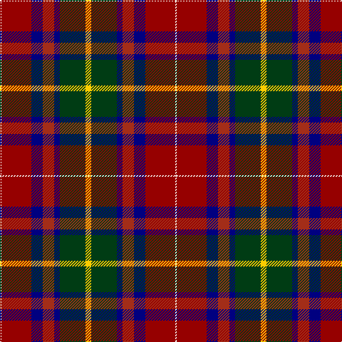

The parent of this is [G P Bathija (Shikarpur, Sindh)](/tartans/w/2/dr42/db16/r16/db8/dg36/y/8/)

This was sourced from register-of-tartans.  It is a [7 stripes tartan](/stripes/stripes7/).

Original link https://www.tartanregister.gov.uk/tartanDetails.aspx?ref=10690

## Thread count
W/2 DR42 DB16 R16 DB8 DG36 Y/8

## Palette
Each colour and its ΔE from the base-6 reference it is a variant of.

| Colour | Shade | Base | ΔE (OKLab) |
|---|---|---|---|
| DB |  `#000080` | B  | 0.14 |
| DG |  `#003C14` | G  | 0.14 |
| DR |  `#960000` | R  | 0.11 |
| R |  `#A32D18` | R  | 0.07 |
| W |  `#F9F5EF` | W  | 0.01 |
| Y |  `#FCCC00` | Y  | 0.04 |

# Sample pattern

ID: /variants/w/2/dr42/db16/r16/db8/dg36/y/8-db000080-dg003c14-dr960000-ra32d18-wf9f5ef-yfccc00/
