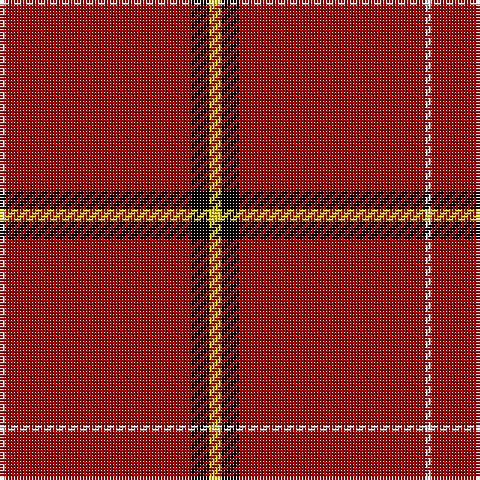

The parent of this is [Riddick Furya](/tartans/w/2/dr62/k6/y/4/)

This was sourced from register-of-tartans.  It is a [4 stripes tartan](/stripes/stripes4/).

Original link https://www.tartanregister.gov.uk/tartanDetails.aspx?ref=11548

## Thread count
W/2 DR62 K6 Y/4

## Palette
Each colour and its ΔE from the base-6 reference it is a variant of.

| Colour | Shade | Base | ΔE (OKLab) |
|---|---|---|---|
| DR |  `#A00000` | R  | 0.09 |
| K |  `#000000` | K  | 0.00 |
| W |  `#F8F8F8` | W  | 0.01 |
| Y |  `#FCCC00` | Y  | 0.04 |

# Sample pattern

ID: /variants/w/2/dr62/k6/y/4-dra00000-k000000-wf8f8f8-yfccc00/
