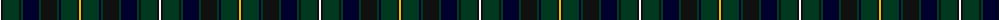

The parent of this is [Robieson, Graham A. (Personal)](/tartans/w/2/k2/dg16/k2/dg2/db16/dg2/k16/dg2/db2/dg16/k2/y/2/)

This was sourced from tartans-authority.  It is a [13 stripes tartan](/stripes/stripes13/).

Original link http://www.tartansauthority.com/tartan-ferret/display/6724/

## Thread count
W/2 K2 DG16 K2 DG2 DB16 DG2 K16 DG2 DB2 DG16 K2 Y/2

## Palette
Each colour and its ΔE from the base-6 reference it is a variant of.

| Colour | Shade | Base | ΔE (OKLab) |
|---|---|---|---|
| DB |  `#00002C` | K  | 0.16 |
| DG |  `#003820` | G  | 0.16 |
| K |  `#101010` | K  | 0.17 |
| W |  `#F8F8F8` | W  | 0.01 |
| Y |  `#E8C000` | Y  | 0.00 |

ID: /variants/w/2/k2/dg16/k2/dg2/db16/dg2/k16/dg2/db2/dg16/k2/y/2-db00002c-dg003820-k101010-wf8f8f8-ye8c000/
