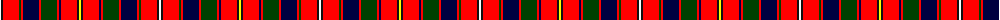

The parent of this is [Robieson](/tartans/w/2/k2/r16/g2/r2/db16/r2/g16/r2/db2/r16/k2/y/2/)

This was sourced from register-of-tartans.  It is a [13 stripes tartan](/stripes/stripes13/).

Original link https://www.tartanregister.gov.uk/tartanDetails.aspx?ref=5914

## Thread count
W/2 K2 R16 G2 R2 DB16 R2 G16 R2 DB2 R16 K2 Y/2

## Palette
Each colour and its ΔE from the base-6 reference it is a variant of.

| Colour | Shade | Base | ΔE (OKLab) |
|---|---|---|---|
| DB |  `#000040` | K  | 0.20 |
| G |  `#004000` | G  | 0.12 |
| K |  `#101010` | K  | 0.17 |
| R |  `#FF0000` | R  | 0.11 |
| W |  `#FFFFFF` | W  | 0.03 |
| Y |  `#FFFF00` | Y  | 0.16 |

ID: /variants/w/2/k2/r16/g2/r2/db16/r2/g16/r2/db2/r16/k2/y/2-db000040-g004000-k101010-rff0000-wffffff-yffff00/
