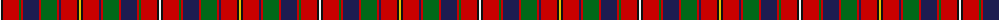

The parent of this is [Robieson (Name)](/tartans/w/2/k2/r16/g2/r2/db16/r2/g16/r2/db2/r16/k2/y/2/)

This was sourced from tartans-authority.  It is a [13 stripes tartan](/stripes/stripes13/).

Original link http://www.tartansauthority.com/tartan-ferret/display/6869/

## Thread count
W/2 K2 R16 G2 R2 DB16 R2 G16 R2 DB2 R16 K2 Y/2

## Palette
Each colour and its ΔE from the base-6 reference it is a variant of.

| Colour | Shade | Base | ΔE (OKLab) |
|---|---|---|---|
| DB |  `#1C1C50` | B  | 0.14 |
| G |  `#006818` | G  | 0.02 |
| K |  `#101010` | K  | 0.17 |
| R |  `#C80000` | R  | 0.00 |
| W |  `#F8F8F8` | W  | 0.01 |
| Y |  `#E8C000` | Y  | 0.00 |

ID: /variants/w/2/k2/r16/g2/r2/db16/r2/g16/r2/db2/r16/k2/y/2-db1c1c50-g006818-k101010-rc80000-wf8f8f8-ye8c000/
