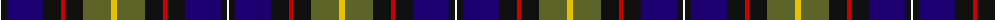
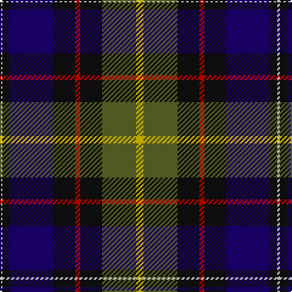

The parent of this is [Ayre (Personal)](/tartans/w/2/k6/db36/k18/r4/k18/g28/y/6/)

This was sourced from tartans-authority.  It is a [8 stripes tartan](/stripes/stripes8/).

Original link http://www.tartansauthority.com/tartan-ferret/display/6305/

## Thread count
W/2 K6 DB36 K18 R4 K18 G28 Y/6

## Palette
Each colour and its ΔE from the base-6 reference it is a variant of.

| Colour | Shade | Base | ΔE (OKLab) |
|---|---|---|---|
| DB |  `#1C0070` | B  | 0.14 |
| G |  `#5C6428` | G  | 0.09 |
| K |  `#101010` | K  | 0.17 |
| R |  `#C80000` | R  | 0.00 |
| W |  `#F8F8F8` | W  | 0.01 |
| Y |  `#E8C000` | Y  | 0.00 |

# Sample pattern

ID: /variants/w/2/k6/db36/k18/r4/k18/g28/y/6-db1c0070-g5c6428-k101010-rc80000-wf8f8f8-ye8c000/
