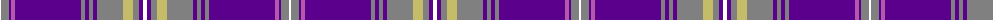

The parent of this is [Scottish Bakers](/tartans/w/2/n8/p2/pa4/p66/n4/p4/n4/p4/n26/lg10/n6/p4/w/4/)

This was sourced from register-of-tartans.  It is a [14 stripes tartan](/stripes/stripes14/).

Original link https://www.tartanregister.gov.uk/tartanDetails.aspx?ref=11513

## Thread count
W/2 N8 P2 Pa4 P66 N4 P4 N4 P4 N26 LG10 N6 P4 W/4

## Palette
Each colour and its ΔE from the base-6 reference it is a variant of.

| Colour | Shade | Base | ΔE (OKLab) |
|---|---|---|---|
| LG |  `#C4BC68` | Y  | 0.07 |
| N |  `#808080` | G  | 0.22 |
| P |  `#5A008C` | B  | 0.12 |
| Pa |  `#B458AC` | R  | 0.20 |
| W |  `#FFFFFF` | W  | 0.03 |

ID: /variants/w/2/n8/p2/pa4/p66/n4/p4/n4/p4/n26/lg10/n6/p4/w/4-lgc4bc68-n808080-p5a008c-pab458ac-wffffff/
