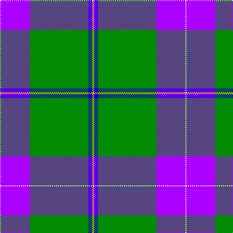

The parent of this is [McGuinness, Tam (Personal)](/tartans/w/2/p60/g120/b8/y/4/)

This was sourced from register-of-tartans.  It is a [5 stripes tartan](/stripes/stripes5/).

Original link https://www.tartanregister.gov.uk/tartanDetails.aspx?ref=10581

## Thread count
W/2 P60 G120 B8 Y/4

## Palette
Each colour and its ΔE from the base-6 reference it is a variant of.

| Colour | Shade | Base | ΔE (OKLab) |
|---|---|---|---|
| B |  `#0000CD` | B  | 0.15 |
| G |  `#008B00` | G  | 0.12 |
| P |  `#AA00FF` | B  | 0.29 |
| W |  `#FFFFFF` | W  | 0.03 |
| Y |  `#FFA500` | Y  | 0.07 |

# Sample pattern

ID: /variants/w/2/p60/g120/b8/y/4-b0000cd-g008b00-paa00ff-wffffff-yffa500/
