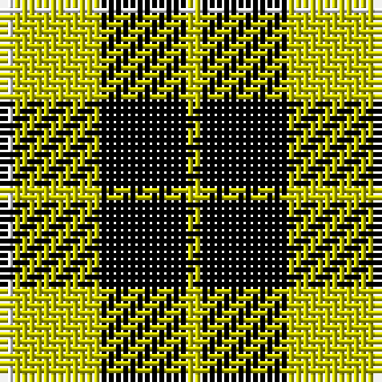

The parent of this is [Barclay Dress](/tartans/w/2/y12/k12/y/2/)

This was sourced from weddslist.  It is a [4 stripes tartan](/stripes/stripes4/).

Original link http://www.weddslist.com/cgi-bin/tartans/pg.pl?source=rb

## Thread count
W/2 Y12 K12 Y/2

## Palette
Each colour and its ΔE from the base-6 reference it is a variant of.

| Colour | Shade | Base | ΔE (OKLab) |
|---|---|---|---|
| K |  `#000000` | K  | 0.00 |
| W |  `#FFFFFF` | W  | 0.03 |
| Y |  `#C8C800` | Y  | 0.05 |

# Sample pattern

ID: /variants/w/2/y12/k12/y/2-k000000-wffffff-yc8c800/
