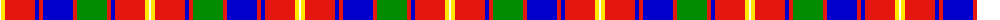

The parent of this is [Robbie (Stirling) (Personal)](/tartans/w/2/y4/r30/b4/r4/b30/r4/g30/r4/b4/r30/y4/w/2/)

This was sourced from register-of-tartans.  It is a [13 stripes tartan](/stripes/stripes13/).

Original link https://www.tartanregister.gov.uk/tartanDetails.aspx?ref=10383

## Thread count
W/2 Y4 R30 B4 R4 B30 R4 G30 R4 B4 R30 Y4 W/2

## Palette
Each colour and its ΔE from the base-6 reference it is a variant of.

| Colour | Shade | Base | ΔE (OKLab) |
|---|---|---|---|
| B |  `#0000CD` | B  | 0.15 |
| G |  `#008B00` | G  | 0.12 |
| R |  `#E3170D` | R  | 0.06 |
| W |  `#FFFFFF` | W  | 0.03 |
| Y |  `#FFE700` | Y  | 0.11 |

ID: /variants/w/2/y4/r30/b4/r4/b30/r4/g30/r4/b4/r30/y4/w/2-b0000cd-g008b00-re3170d-wffffff-yffe700/
