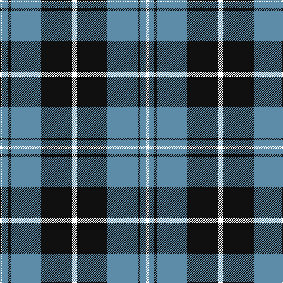

The parent of this is [Indian Pipe Band (Corporate)](/tartans/w/4/b10/k4/b52/k52/w/8/)

This was sourced from tartans-authority.  It is a [6 stripes tartan](/stripes/stripes6/).

Original link http://www.tartansauthority.com/tartan-ferret/display/8970/

## Thread count
W/4 B10 K4 B52 K52 W/8

## Palette
Each colour and its ΔE from the base-6 reference it is a variant of.

| Colour | Shade | Base | ΔE (OKLab) |
|---|---|---|---|
| B |  `#5C8CA8` | B  | 0.23 |
| K |  `#101010` | K  | 0.17 |
| W |  `#FCFCFC` | W  | 0.03 |

# Sample pattern

ID: /variants/w/4/b10/k4/b52/k52/w/8-b5c8ca8-k101010-wfcfcfc/
