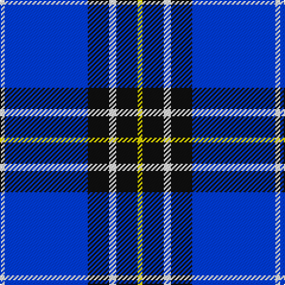

The parent of this is [Hannah (Personal)](/tartans/w/4/b70/k18/w6/k18/y/4/)

This was sourced from register-of-tartans.  It is a [6 stripes tartan](/stripes/stripes6/).

Original link https://www.tartanregister.gov.uk/tartanDetails.aspx?ref=5976

## Thread count
W/4 B70 K18 W6 K18 Y/4

## Palette
Each colour and its ΔE from the base-6 reference it is a variant of.

| Colour | Shade | Base | ΔE (OKLab) |
|---|---|---|---|
| B |  `#003DF5` | B  | 0.18 |
| K |  `#101010` | K  | 0.17 |
| W |  `#FFFFFF` | W  | 0.03 |
| Y |  `#FFE600` | Y  | 0.10 |

# Sample pattern

ID: /variants/w/4/b70/k18/w6/k18/y/4-b003df5-k101010-wffffff-yffe600/
