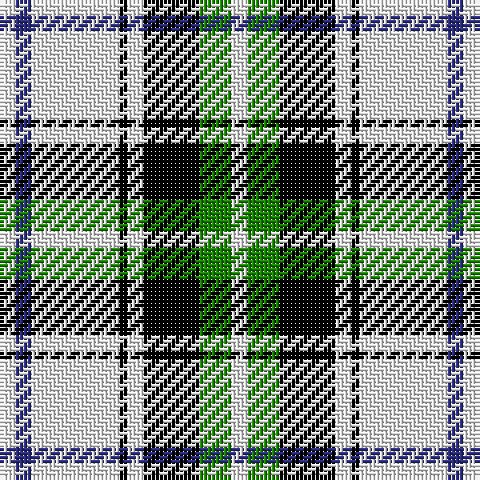

The parent of this is [Forbes - 1880 (Clans Originaux)](/tartans/w/4/db4/w22/k2/w4/k14/g8/w/4/)

This was sourced from tartans-authority.  It is a [8 stripes tartan](/stripes/stripes8/).

Original link http://www.tartansauthority.com/tartan-ferret/display/3490/

## Thread count
W/4 DB4 W22 K2 W4 K14 G8 W/4

## Palette
Each colour and its ΔE from the base-6 reference it is a variant of.

| Colour | Shade | Base | ΔE (OKLab) |
|---|---|---|---|
| DB |  `#2C2C80` | B  | 0.05 |
| G |  `#188400` | G  | 0.10 |
| K |  `#000000` | K  | 0.00 |
| W |  `#F8F8F8` | W  | 0.01 |

# Sample pattern

ID: /variants/w/4/db4/w22/k2/w4/k14/g8/w/4-db2c2c80-g188400-k000000-wf8f8f8/
