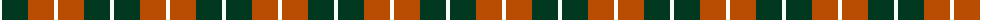
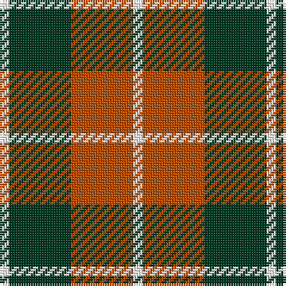

The parent of this is [Dunoon Irish](/tartans/w/4/dg26/do26/w/4/)

This was sourced from register-of-tartans.  It is a [4 stripes tartan](/stripes/stripes4/).

Original link https://www.tartanregister.gov.uk/tartanDetails.aspx?ref=1049

## Thread count
W/4 DG26 DO26 W/4

## Palette
Each colour and its ΔE from the base-6 reference it is a variant of.

| Colour | Shade | Base | ΔE (OKLab) |
|---|---|---|---|
| DG |  `#003820` | G  | 0.16 |
| DO |  `#B84C00` | R  | 0.08 |
| W |  `#FCFCFC` | W  | 0.03 |

# Sample pattern

ID: /variants/w/4/dg26/do26/w/4-dg003820-dob84c00-wfcfcfc/
