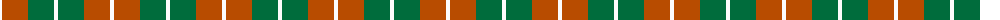
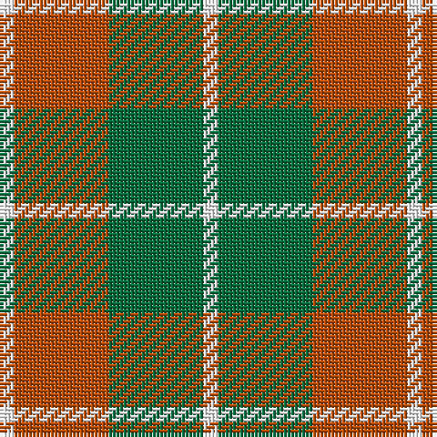

The parent of this is [Dunoon Irish (Corporate)](/tartans/w/4/do26/g26/w/4/)

This was sourced from tartans-authority.  It is a [4 stripes tartan](/stripes/stripes4/).

Original link http://www.tartansauthority.com/tartan-ferret/display/1802/

## Thread count
W/4 DO26 G26 W/4

## Palette
Each colour and its ΔE from the base-6 reference it is a variant of.

| Colour | Shade | Base | ΔE (OKLab) |
|---|---|---|---|
| DO |  `#B84C00` | R  | 0.08 |
| G |  `#006C3C` | G  | 0.05 |
| W |  `#FCFCFC` | W  | 0.03 |

# Sample pattern

ID: /variants/w/4/do26/g26/w/4-dob84c00-g006c3c-wfcfcfc/
