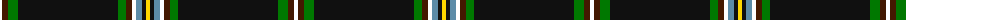

The parent of this is [Hawes (2014)](/tartans/w/4/dr6/g10/k100/g8/dr6/w4/b6/k4/y/4/)

This was sourced from register-of-tartans.  It is a [10 stripes tartan](/stripes/stripes10/).

Original link https://www.tartanregister.gov.uk/tartanDetails.aspx?ref=11169

## Thread count
W/4 DR6 G10 K100 G8 DR6 W4 B6 K4 Y/4

## Palette
Each colour and its ΔE from the base-6 reference it is a variant of.

| Colour | Shade | Base | ΔE (OKLab) |
|---|---|---|---|
| B |  `#5C8CA8` | B  | 0.23 |
| DR |  `#441800` | B  | 0.22 |
| G |  `#007800` | G  | 0.06 |
| K |  `#101010` | K  | 0.17 |
| W |  `#FFFFFF` | W  | 0.03 |
| Y |  `#FFD700` | Y  | 0.07 |

ID: /variants/w/4/dr6/g10/k100/g8/dr6/w4/b6/k4/y/4-b5c8ca8-dr441800-g007800-k101010-wffffff-yffd700/
