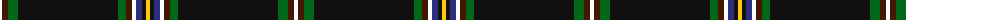

The parent of this is [Hawks (2014)](/tartans/w/4/dr6/g10/k100/g8/dr6/w4/db6/k4/y/4/)

This was sourced from tartans-authority.  It is a [10 stripes tartan](/stripes/stripes10/).

Original link http://www.tartansauthority.com/tartan-ferret/display/11169/

## Thread count
W/4 DR6 G10 K100 G8 DR6 W4 DB6 K4 Y/4

## Palette
Each colour and its ΔE from the base-6 reference it is a variant of.

| Colour | Shade | Base | ΔE (OKLab) |
|---|---|---|---|
| DB |  `#2C2C80` | B  | 0.05 |
| DR |  `#441800` | B  | 0.22 |
| G |  `#006818` | G  | 0.02 |
| K |  `#101010` | K  | 0.17 |
| W |  `#FCFCFC` | W  | 0.03 |
| Y |  `#FCCC00` | Y  | 0.04 |

ID: /variants/w/4/dr6/g10/k100/g8/dr6/w4/db6/k4/y/4-db2c2c80-dr441800-g006818-k101010-wfcfcfc-yfccc00/
