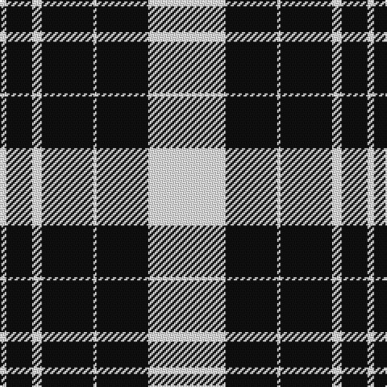

The parent of this is [Saks Fifth Avenue (Corp)](/tartans/w/4/k16/w6/k32/w2/k32/w/48/)

This was sourced from tartans-authority.  It is a [7 stripes tartan](/stripes/stripes7/).

Original link http://www.tartansauthority.com/tartan-ferret/display/8525/

## Thread count
W/4 K16 W6 K32 W2 K32 W/48

## Palette
Each colour and its ΔE from the base-6 reference it is a variant of.

| Colour | Shade | Base | ΔE (OKLab) |
|---|---|---|---|
| K |  `#101010` | K  | 0.17 |
| W |  `#FCFCFC` | W  | 0.03 |

# Sample pattern

ID: /variants/w/4/k16/w6/k32/w2/k32/w/48-k101010-wfcfcfc/
