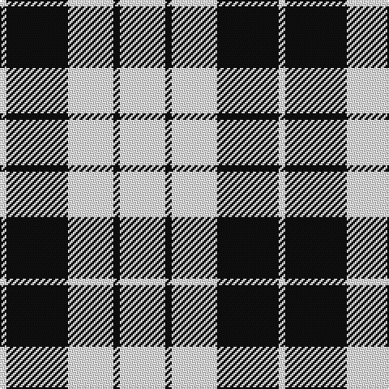

The parent of this is [MacLeod B&W - 1906 (Clan)](/tartans/w/4/k38/w28/k4/w/28/)

This was sourced from tartans-authority.  It is a [5 stripes tartan](/stripes/stripes5/).

Original link http://www.tartansauthority.com/tartan-ferret/display/1828/

## Thread count
W/4 K38 W28 K4 W/28

## Palette
Each colour and its ΔE from the base-6 reference it is a variant of.

| Colour | Shade | Base | ΔE (OKLab) |
|---|---|---|---|
| K |  `#101010` | K  | 0.17 |
| W |  `#FCFCFC` | W  | 0.03 |

# Sample pattern

ID: /variants/w/4/k38/w28/k4/w/28-k101010-wfcfcfc/
