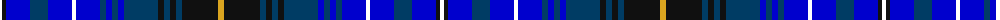

The parent of this is [Van Ingelgem Dress (Personal)](/tartans/w/4/k4/b24/db18/b24/w4/b24/db6/b6/db6/b6/db34/k6/db6/k6/db6/k36/y/6/)

This was sourced from register-of-tartans.  It is a [18 stripes tartan](/stripes/stripes18/).

Original link https://www.tartanregister.gov.uk/tartanDetails.aspx?ref=5430

## Thread count
W/4 K4 B24 DB18 B24 W4 B24 DB6 B6 DB6 B6 DB34 K6 DB6 K6 DB6 K36 Y/6

## Palette
Each colour and its ΔE from the base-6 reference it is a variant of.

| Colour | Shade | Base | ΔE (OKLab) |
|---|---|---|---|
| B |  `#0000CD` | B  | 0.15 |
| DB |  `#003C64` | B  | 0.07 |
| K |  `#101010` | K  | 0.17 |
| W |  `#FFFFFF` | W  | 0.03 |
| Y |  `#DAA520` | Y  | 0.08 |

ID: /variants/w/4/k4/b24/db18/b24/w4/b24/db6/b6/db6/b6/db34/k6/db6/k6/db6/k36/y/6-b0000cd-db003c64-k101010-wffffff-ydaa520/
