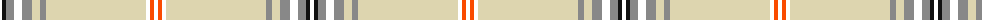

The parent of this is [Bourbon, Sebastien (Personal)](/tartans/w/4/k4/n8/w8/n10/lr8/n6/lr100/w4/r4/w/4/)

This was sourced from register-of-tartans.  It is a [11 stripes tartan](/stripes/stripes11/).

Original link https://www.tartanregister.gov.uk/tartanDetails.aspx?ref=11307

## Thread count
W/4 K4 N8 W8 N10 LR8 N6 LR100 W4 R4 W/4

## Palette
Each colour and its ΔE from the base-6 reference it is a variant of.

| Colour | Shade | Base | ΔE (OKLab) |
|---|---|---|---|
| K |  `#101010` | K  | 0.17 |
| LR |  `#DDD5AF` | W  | 0.11 |
| N |  `#888888` | R  | 0.24 |
| R |  `#FA4B00` | R  | 0.14 |
| W |  `#FFFFFF` | W  | 0.03 |

ID: /variants/w/4/k4/n8/w8/n10/lr8/n6/lr100/w4/r4/w/4-k101010-lrddd5af-n888888-rfa4b00-wffffff/
