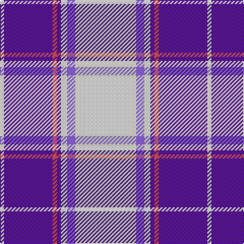

The parent of this is [St Andrews Links Dress Corporate Tartan Tartan Number: 10506. Earliest known date: 01/04/2011 A Dress variation of the St Andrews Links tartan (Scottish Tartan Register ref.3880). See products available Copyright © Blair Urquhart, Comrie, 2015](/tartans/w/4/p48/do4/p4/wa6/pa8/wa/60/)

This was sourced from house-of-tartan.  It is a [7 stripes tartan](/stripes/stripes7/).

Original link http://www.house-of-tartan.scotland.net/house/TartanViewjs.asp?colr=Def&tnam=10506

## Thread count
W/4 P48 DO4 P4 Wa6 Pa8 Wa/60

## Palette
Each colour and its ΔE from the base-6 reference it is a variant of.

| Colour | Shade | Base | ΔE (OKLab) |
|---|---|---|---|
| DO |  `#CD5555` | R  | 0.10 |
| P |  `#551A8B` | B  | 0.10 |
| Pa |  `#8968CD` | B  | 0.21 |
| W |  `#FFFFFF` | W  | 0.03 |
| Wa |  `#FDF5E6` | W  | 0.02 |

# Sample pattern

ID: /variants/w/4/p48/do4/p4/wa6/pa8/wa/60-docd5555-p551a8b-pa8968cd-wffffff-wafdf5e6/
