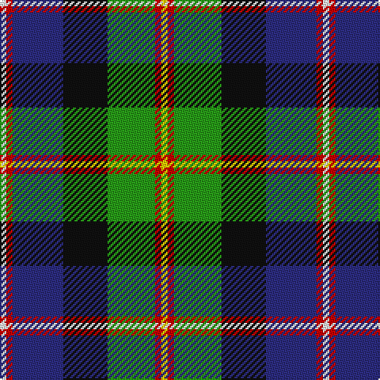

The parent of this is [Council of Scottish Clans & Ass. (Co](/tartans/w/4/r4/db32/k28/g30/r4/y/4/)

This was sourced from tartans-authority.  It is a [7 stripes tartan](/stripes/stripes7/).

Original link http://www.tartansauthority.com/tartan-ferret/display/3857/

## Thread count
W/4 R4 DB32 K28 G30 R4 Y/4

## Palette
Each colour and its ΔE from the base-6 reference it is a variant of.

| Colour | Shade | Base | ΔE (OKLab) |
|---|---|---|---|
| DB |  `#2C2C80` | B  | 0.05 |
| G |  `#289C18` | G  | 0.18 |
| K |  `#101010` | K  | 0.17 |
| R |  `#C80000` | R  | 0.00 |
| W |  `#FCFCFC` | W  | 0.03 |
| Y |  `#FCCC00` | Y  | 0.04 |

# Sample pattern

ID: /variants/w/4/r4/db32/k28/g30/r4/y/4-db2c2c80-g289c18-k101010-rc80000-wfcfcfc-yfccc00/
