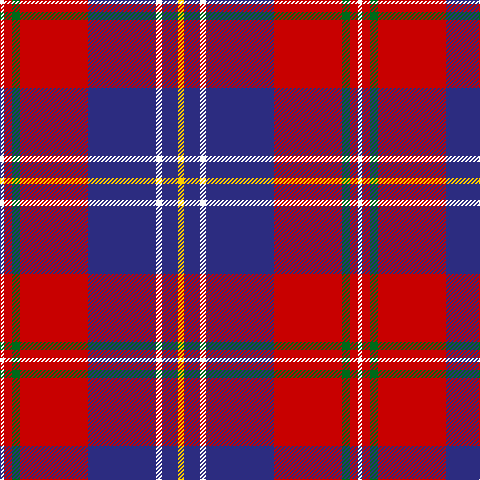

The parent of this is [Manitoba Masonic (Corporate)](/tartans/w/4/r8/g8/r68/db68/w6/db16/y/6/)

This was sourced from tartans-authority.  It is a [8 stripes tartan](/stripes/stripes8/).

Original link http://www.tartansauthority.com/tartan-ferret/display/10615/

## Thread count
W/4 R8 G8 R68 DB68 W6 DB16 Y/6

## Palette
Each colour and its ΔE from the base-6 reference it is a variant of.

| Colour | Shade | Base | ΔE (OKLab) |
|---|---|---|---|
| DB |  `#2C2C80` | B  | 0.05 |
| G |  `#006818` | G  | 0.02 |
| R |  `#C80000` | R  | 0.00 |
| W |  `#FCFCFC` | W  | 0.03 |
| Y |  `#FCCC00` | Y  | 0.04 |

# Sample pattern

ID: /variants/w/4/r8/g8/r68/db68/w6/db16/y/6-db2c2c80-g006818-rc80000-wfcfcfc-yfccc00/
