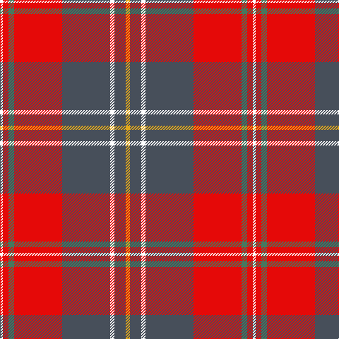

The parent of this is [Manitoba Masonic](/tartans/w/4/r8/g8/r68/n68/w6/n16/y/6/)

This was sourced from register-of-tartans.  It is a [8 stripes tartan](/stripes/stripes8/).

Original link https://www.tartanregister.gov.uk/tartanDetails.aspx?ref=10615

## Thread count
W/4 R8 G8 R68 N68 W6 N16 Y/6

## Palette
Each colour and its ΔE from the base-6 reference it is a variant of.

| Colour | Shade | Base | ΔE (OKLab) |
|---|---|---|---|
| G |  `#46785E` | G  | 0.13 |
| N |  `#474F5A` | B  | 0.10 |
| R |  `#E50908` | R  | 0.06 |
| W |  `#FFFFFF` | W  | 0.03 |
| Y |  `#E2A81A` | Y  | 0.06 |

# Sample pattern

ID: /variants/w/4/r8/g8/r68/n68/w6/n16/y/6-g46785e-n474f5a-re50908-wffffff-ye2a81a/
