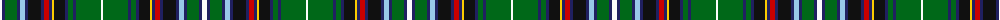

The parent of this is [Kumikyoku - Tone of Forest](/tartans/w/5/db3/g12/db3/lb5/db3/k13/db3/r5/db3/y2/k11/db3/g5/db3/g25/w/2/)

This was sourced from tartans-authority.  It is a [17 stripes tartan](/stripes/stripes17/).

Original link http://www.tartansauthority.com/tartan-ferret/display/11286/

## Thread count
W/5 DB3 G12 DB3 LB5 DB3 K13 DB3 R5 DB3 Y2 K11 DB3 G5 DB3 G25 W/2

## Palette
Each colour and its ΔE from the base-6 reference it is a variant of.

| Colour | Shade | Base | ΔE (OKLab) |
|---|---|---|---|
| DB |  `#202060` | B  | 0.11 |
| G |  `#006818` | G  | 0.02 |
| K |  `#101010` | K  | 0.17 |
| LB |  `#98C8E8` | W  | 0.17 |
| R |  `#C80000` | R  | 0.00 |
| W |  `#FCFCFC` | W  | 0.03 |
| Y |  `#FCCC00` | Y  | 0.04 |

ID: /variants/w/5/db3/g12/db3/lb5/db3/k13/db3/r5/db3/y2/k11/db3/g5/db3/g25/w/2-db202060-g006818-k101010-lb98c8e8-rc80000-wfcfcfc-yfccc00/
