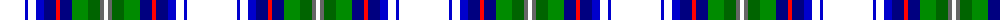

The parent of this is [Fothergill, Baron of Kinross (P Name Tartan Tartan Number: 10695. Earliest known date: 12 September 2012 The design of this tartan was commissioned by Donald Fothergill, Baron of Kinross, to celebrate the beauty of Kinross House, its gardens and its vista across Loch Leven to Loch Leven Castle. The design is based on the Royal Stewart tartan in reference to the fact that Mary Queen of Scots abdicated in favour of her son James VI whilst imprisoned in Loch Leven Castle. Sir William Bruce, who built Kinross House, deliberately set it in a designed landscape that included Loch Leven Castle. The colours used for the Fothergill tartan were specifically chosen to represent the stone from the local Cleish quarry, from which Kinross House was built, and the spectacular gardens and loch that fall within the designed landscape. The blue and parchment white shades and the rich red found in the tartan also reflect the heraldic colours in the Arms of Donald Fothergill. See products available Copyright © Blair Urquhart, Comrie, 2015](/tartans/w/50/b3/w8/b8/db12/r4/db12/g16/ga12/n4/w/4/)

This was sourced from house-of-tartan.  It is a [11 stripes tartan](/stripes/stripes11/).

Original link http://www.house-of-tartan.scotland.net/house/TartanViewjs.asp?colr=Def&tnam=10695

## Thread count
W/50 B3 W8 B8 DB12 R4 DB12 G16 Ga12 N4 W/4

## Palette
Each colour and its ΔE from the base-6 reference it is a variant of.

| Colour | Shade | Base | ΔE (OKLab) |
|---|---|---|---|
| B |  `#0000CD` | B  | 0.15 |
| DB |  `#000080` | B  | 0.14 |
| G |  `#008B00` | G  | 0.12 |
| Ga |  `#006400` | G  | 0.00 |
| N |  `#666666` | B  | 0.16 |
| R |  `#FF0000` | R  | 0.11 |
| W |  `#FFFFFF` | W  | 0.03 |

ID: /variants/w/50/b3/w8/b8/db12/r4/db12/g16/ga12/n4/w/4-b0000cd-db000080-g008b00-ga006400-n666666-rff0000-wffffff/
