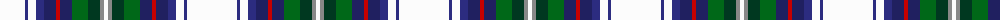

The parent of this is [Fothergill (Personal)](/tartans/w/50/db3/w8/db8/dba12/r4/dba12/g16/dg12/n4/w/4/)

This was sourced from tartans-authority.  It is a [11 stripes tartan](/stripes/stripes11/).

Original link http://www.tartansauthority.com/tartan-ferret/display/10695/

## Thread count
W/50 DB3 W8 DB8 DBa12 R4 DBa12 G16 DG12 N4 W/4

## Palette
Each colour and its ΔE from the base-6 reference it is a variant of.

| Colour | Shade | Base | ΔE (OKLab) |
|---|---|---|---|
| DB |  `#2C2C80` | B  | 0.05 |
| DBa |  `#202060` | B  | 0.11 |
| DG |  `#003820` | G  | 0.16 |
| G |  `#006818` | G  | 0.02 |
| N |  `#888888` | R  | 0.24 |
| R |  `#C80000` | R  | 0.00 |
| W |  `#FCFCFC` | W  | 0.03 |

ID: /variants/w/50/db3/w8/db8/dba12/r4/dba12/g16/dg12/n4/w/4-db2c2c80-dba202060-dg003820-g006818-n888888-rc80000-wfcfcfc/
