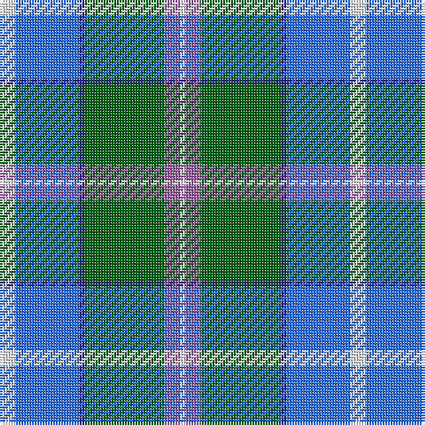

The parent of this is [Eeraerts, Laurent (Personal)](/tartans/w/6/b24/db2/g30/lp6/w/2/)

This was sourced from register-of-tartans.  It is a [6 stripes tartan](/stripes/stripes6/).

Original link https://www.tartanregister.gov.uk/tartanDetails.aspx?ref=11659

## Thread count
W/6 B24 DB2 G30 LP6 W/2

## Palette
Each colour and its ΔE from the base-6 reference it is a variant of.

| Colour | Shade | Base | ΔE (OKLab) |
|---|---|---|---|
| B |  `#3474FC` | B  | 0.23 |
| DB |  `#2C2C80` | B  | 0.05 |
| G |  `#006818` | G  | 0.02 |
| LP |  `#9C68A4` | R  | 0.21 |
| W |  `#FFFFFF` | W  | 0.03 |

# Sample pattern

ID: /variants/w/6/b24/db2/g30/lp6/w/2-b3474fc-db2c2c80-g006818-lp9c68a4-wffffff/
