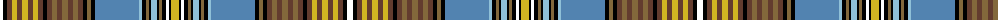

The parent of this is [Whiskey & Bourbon](/tartans/w/6/k4/t5/y5/t5/y6/t5/y5/t5/k4/t5/lt5/t5/lt6/t5/lt5/t5/k4/lt4/k4/b44/lb3/k4/lt3/k2/lb6/k2/lt3/k4/w3/k2/y/8/)

This was sourced from register-of-tartans.  It is a [32 stripes tartan](/stripes/stripes32/).

Original link https://www.tartanregister.gov.uk/tartanDetails.aspx?ref=10544

## Thread count
W/6 K4 T5 Y5 T5 Y6 T5 Y5 T5 K4 T5 LT5 T5 LT6 T5 LT5 T5 K4 LT4 K4 B44 LB3 K4 LT3 K2 LB6 K2 LT3 K4 W3 K2 Y/8

## Palette
Each colour and its ΔE from the base-6 reference it is a variant of.

| Colour | Shade | Base | ΔE (OKLab) |
|---|---|---|---|
| B |  `#5283B0` | B  | 0.21 |
| K |  `#000000` | K  | 0.00 |
| LB |  `#8FC0D7` | W  | 0.20 |
| LT |  `#83683B` | G  | 0.16 |
| T |  `#633C2E` | B  | 0.16 |
| W |  `#FFFFFF` | W  | 0.03 |
| Y |  `#D0B522` | Y  | 0.05 |

ID: /variants/w/6/k4/t5/y5/t5/y6/t5/y5/t5/k4/t5/lt5/t5/lt6/t5/lt5/t5/k4/lt4/k4/b44/lb3/k4/lt3/k2/lb6/k2/lt3/k4/w3/k2/y/8-b5283b0-k000000-lb8fc0d7-lt83683b-t633c2e-wffffff-yd0b522/
