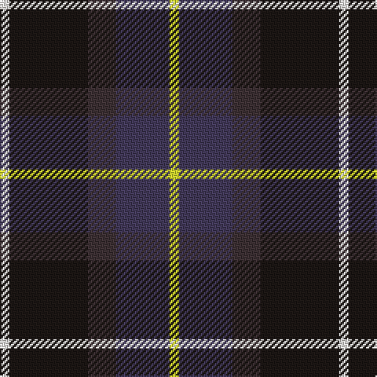

The parent of this is [Teylu Coleman (Cornwall)](/tartans/w/6/k50/t18/n34/y/6/)

This was sourced from register-of-tartans.  It is a [5 stripes tartan](/stripes/stripes5/).

Original link https://www.tartanregister.gov.uk/tartanDetails.aspx?ref=10792

## Thread count
W/6 K50 T18 N34 Y/6

## Palette
Each colour and its ΔE from the base-6 reference it is a variant of.

| Colour | Shade | Base | ΔE (OKLab) |
|---|---|---|---|
| K |  `#1C1714` | K  | 0.21 |
| N |  `#433A5A` | B  | 0.08 |
| T |  `#3D3134` | B  | 0.14 |
| W |  `#F9F5EF` | W  | 0.01 |
| Y |  `#E1F231` | Y  | 0.12 |

# Sample pattern

ID: /variants/w/6/k50/t18/n34/y/6-k1c1714-n433a5a-t3d3134-wf9f5ef-ye1f231/
