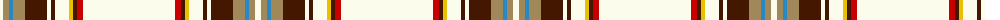

The parent of this is [Diana, Plaid Dress](/tartans/w/6/lt6/b4/lt12/dr22/w4/dr4/w14/y4/dr4/r6/w/92/)

This was sourced from register-of-tartans.  It is a [12 stripes tartan](/stripes/stripes12/).

Original link https://www.tartanregister.gov.uk/tartanDetails.aspx?ref=933

## Thread count
W/6 LT6 B4 LT12 DR22 W4 DR4 W14 Y4 DR4 R6 W/92

## Palette
Each colour and its ΔE from the base-6 reference it is a variant of.

| Colour | Shade | Base | ΔE (OKLab) |
|---|---|---|---|
| B |  `#2888C4` | B  | 0.21 |
| DR |  `#441800` | B  | 0.22 |
| LT |  `#A08858` | Y  | 0.21 |
| R |  `#C80000` | R  | 0.00 |
| W |  `#FCFCEC` | W  | 0.03 |
| Y |  `#E8C000` | Y  | 0.00 |

ID: /variants/w/6/lt6/b4/lt12/dr22/w4/dr4/w14/y4/dr4/r6/w/92-b2888c4-dr441800-lta08858-rc80000-wfcfcec-ye8c000/
