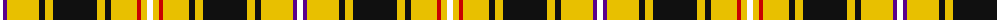

The parent of this is [Loch Sween](/tartans/w/6/p4/y32/k6/y8/k44/y8/k6/y26/r4/y6/w/6/)

This was sourced from register-of-tartans.  It is a [12 stripes tartan](/stripes/stripes12/).

Original link https://www.tartanregister.gov.uk/tartanDetails.aspx?ref=11081

## Thread count
W/6 P4 Y32 K6 Y8 K44 Y8 K6 Y26 R4 Y6 W/6

## Palette
Each colour and its ΔE from the base-6 reference it is a variant of.

| Colour | Shade | Base | ΔE (OKLab) |
|---|---|---|---|
| K |  `#101010` | K  | 0.17 |
| P |  `#5A008C` | B  | 0.12 |
| R |  `#C80000` | R  | 0.00 |
| W |  `#FFFFFF` | W  | 0.03 |
| Y |  `#E8C000` | Y  | 0.00 |

ID: /variants/w/6/p4/y32/k6/y8/k44/y8/k6/y26/r4/y6/w/6-k101010-p5a008c-rc80000-wffffff-ye8c000/
