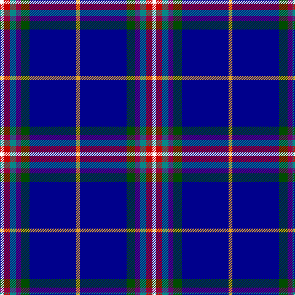

The parent of this is [Blairgowrie Golf Club, The](/tartans/w/6/r10/b10/p8/g14/db76/y/6/)

This was sourced from register-of-tartans.  It is a [7 stripes tartan](/stripes/stripes7/).

Original link https://www.tartanregister.gov.uk/tartanDetails.aspx?ref=11383

## Thread count
W/6 R10 B10 P8 G14 DB76 Y/6

## Palette
Each colour and its ΔE from the base-6 reference it is a variant of.

| Colour | Shade | Base | ΔE (OKLab) |
|---|---|---|---|
| B |  `#048888` | G  | 0.18 |
| DB |  `#00008C` | B  | 0.13 |
| G |  `#004C00` | G  | 0.08 |
| P |  `#6C0070` | B  | 0.15 |
| R |  `#C80000` | R  | 0.00 |
| W |  `#FFFFFF` | W  | 0.03 |
| Y |  `#E0A126` | Y  | 0.08 |

# Sample pattern

ID: /variants/w/6/r10/b10/p8/g14/db76/y/6-b048888-db00008c-g004c00-p6c0070-rc80000-wffffff-ye0a126/
