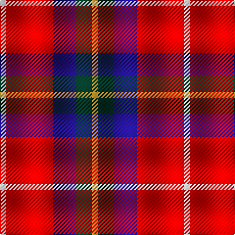

The parent of this is [McGill University](/tartans/w/6/r48/db24/dg16/y/6/)

This was sourced from register-of-tartans.  It is a [5 stripes tartan](/stripes/stripes5/).

Original link https://www.tartanregister.gov.uk/tartanDetails.aspx?ref=10755

## Thread count
W/6 R48 DB24 DG16 Y/6

## Palette
Each colour and its ΔE from the base-6 reference it is a variant of.

| Colour | Shade | Base | ΔE (OKLab) |
|---|---|---|---|
| DB |  `#23138D` | B  | 0.10 |
| DG |  `#063928` | G  | 0.16 |
| R |  `#FF0000` | R  | 0.11 |
| W |  `#FFFFFF` | W  | 0.03 |
| Y |  `#CEA12C` | Y  | 0.09 |

# Sample pattern

ID: /variants/w/6/r48/db24/dg16/y/6-db23138d-dg063928-rff0000-wffffff-ycea12c/
