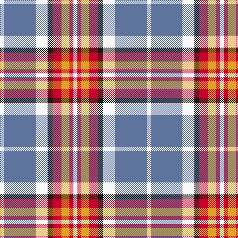

The parent of this is [Brunnbauer (2015)](/tartans/w/8/b64/w24/k10/r18/y16/r8/w/8/)

This was sourced from register-of-tartans.  It is a [8 stripes tartan](/stripes/stripes8/).

Original link https://www.tartanregister.gov.uk/tartanDetails.aspx?ref=11253

## Thread count
W/8 B64 W24 K10 R18 Y16 R8 W/8

## Palette
Each colour and its ΔE from the base-6 reference it is a variant of.

| Colour | Shade | Base | ΔE (OKLab) |
|---|---|---|---|
| B |  `#5F749C` | B  | 0.17 |
| K |  `#1C1714` | K  | 0.21 |
| R |  `#C8002C` | R  | 0.03 |
| W |  `#F8F8F8` | W  | 0.01 |
| Y |  `#E0A126` | Y  | 0.08 |

# Sample pattern

ID: /variants/w/8/b64/w24/k10/r18/y16/r8/w/8-b5f749c-k1c1714-rc8002c-wf8f8f8-ye0a126/
